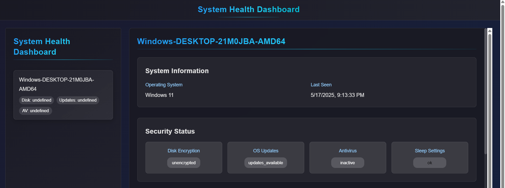

# System Health Monitoring System

A comprehensive system for monitoring and managing system health across multiple machines. The system consists of three main components:

1. System Utility (Client)
2. Backend Server (API + Storage)
3. Admin Dashboard (Frontend)

## Website Preview

Here is a preview of the Admin Dashboard web interface:




## System Utility (Client)

A cross-platform utility that collects system health data and reports it to the backend server.

### Features
- Disk encryption status check
- OS update status monitoring
- Antivirus presence and status verification
- Sleep settings validation (≤ 10 minutes)
- Automatic data reporting to backend server
- Cross-platform support (Windows, macOS, Linux)

### Configuration
The utility can be configured through environment variables or a `.env` file:
- `API_KEY`: Authentication key for the backend server
- `API_URL`: Backend server URL (default: http://localhost:5000)
- `CHECK_INTERVAL`: Time between checks in seconds (15-60 minutes, default: 900)

## Backend Server

A Flask-based API server that stores and manages system health data.

### Features
- Secure HTTP endpoints for data collection
- SQLite database for data storage
- API key authentication
- CSV export functionality with filtering options

### API Endpoints
- `POST /system-data`: Submit system health data
- `GET /machines`: List all machines and their latest status
- `GET /machine/<machine_id>`: Get detailed status for a specific machine
- `GET /machine/<machine_id>/history`: Get historical data for a machine
- `GET /export/csv`: Export data to CSV with filtering options

### CSV Export Filters
- `start_date`: Filter by start date
- `end_date`: Filter by end date
- `machine_id`: Filter by machine ID
- `os_system`: Filter by operating system
- `status`: Filter by status (e.g., 'encrypted', 'up_to_date')
- `check_type`: Filter by check type (e.g., 'disk_encryption', 'os_updates')

## Admin Dashboard

A React-based web interface for monitoring system health.

### Features
- Real-time system status monitoring
- Machine listing with filtering and sorting
- Detailed machine information view
- Historical data visualization
- Status indicators for various checks
- Export functionality

## Installation

### System Utility
```bash
cd utility
pip install -r requirements.txt
python system_checker.py
```

### Backend Server
```bash
cd server
pip install -r requirements.txt
python server.py
```

### Admin Dashboard
```bash
cd client
npm install
npm start
```

## Security

- All API endpoints require authentication using an API key
- Data is transmitted over HTTPS
- Sensitive information is not logged

## Error Handling

- Comprehensive error handling and logging
- Automatic retry mechanisms for failed operations
- Graceful degradation when services are unavailable

## Contributing

1. Fork the repository
2. Create a feature branch
3. Commit your changes
4. Push to the branch
5. Create a Pull Request


